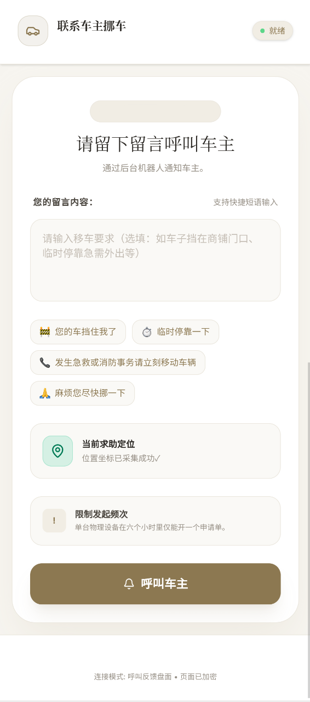
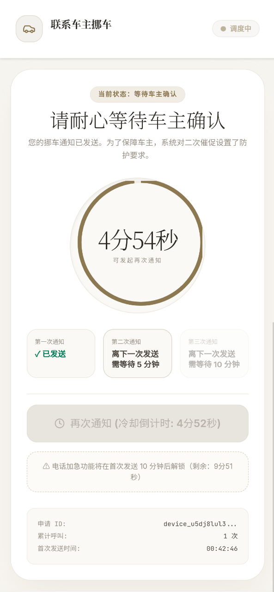
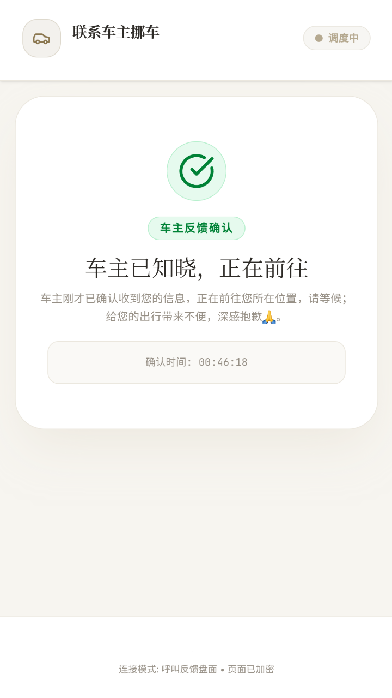
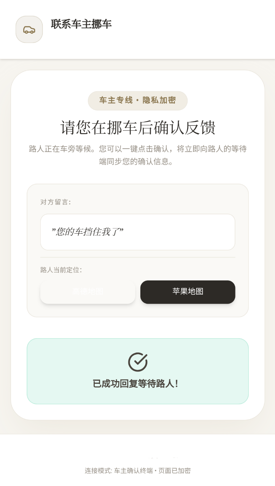

# 挪车通知系统

基于腾讯云 云函数（SCF） + 钉钉机器人 + Redis数据库的挪车通知系统，扫码即可通知车主。

> 本项目灵感来原于 [lesnolie/movecar](https://github.com/lesnolie/movecar) 用Gemini AI编写，进行了多项改进。
>
> 🙏 感谢作者提供的开源基础与参考。

## 界面预览


| 请求者页面                                  |                                             |                                             || 车主页面                                    |
| ------------------------------------------- | ------------------------------------------- | ------------------------------------------- | ------------------------------------------- |
|  |  |  |  |

## 为什么需要它？

- ✅ **不暴露电话号码** - 通过推送通知联系，保护隐私
- ✅ **位置共享** - 车主可确认请求者确实在车旁
- ✅ **设置通知间隔** - 减少骚扰频率
- ✅ **无需服务器** - Serverless 架构，零运维成本
- 📱 **传统/第三方挪车码暴露电话** - 隐私泄露、骚扰电话不断
- 🚗 **被堵车却找不到车主** - 干着急没办法

## 使用流程

### 请求者（需要挪车的人）

1. 扫描车上的二维码，进入通知页面
2. 填写留言（可选），如「挡住出口了」
3. 允许获取位置
4. 点击「通知车主」
5. 等待车主确认，可查看车主位置

如果车主一直没有确认在等待5分钟之后可发起第二次通知，后面每间隔10分钟可再发起一次通知，并且在第一次通知十分钟之后如果车主没有点击确认将会显示车主的手机号码。

当车主在确认页面点击确认了之后将自动提示车主已知晓并不再允许发送通知或显示车主号码

## 部署教程

#### 环境要求

* Node.js 版本 20.x 或更高
* Redis 数据库版本 6.2.x 或更高

### 第一步：下载源代码

```bash
git clone https://github.com/ShimmerLS/movecar
```

### 第二步：进入项目文件安装环境

```bash
npm install
```

### 第三步：生成打包文件

在src/App.tsx里可以自定义修改前端样式或文字

打开 `Untitled-1.json` 把你的数据库信息输入进去备用

```bash
npm run dev
```

把dev文件夹以及package.json、scf_bootstrap打包成ZIP压缩包

### 第四步：创建腾讯云函数服务

1. 打开 [函数服务 - Serverless - 控制台](https://console.cloud.tencent.com/scf/list) 没有腾讯云账号的注册一个
2. 点击「新建」> 选择「从头开始」> 函数类型选择 「web函数」> 运行环境选择 「Nodejs 20.x」>提交方法选择「[本地上传zip包」 把你刚才打包的压缩包上传上去 > 监听端口修改为：3000
3. 高级配置>环境配置里的内存不少于256M
4. 在设置内存的下面有一个「环境变量」点击导入然后复制前面你编辑的`Untitled-1.json`文件里的内容粘贴到「json对象」里
5. 函数URL配置把公网访问选上然后点击完成

### 第五步：云端安装环境

1. 进入你刚才创建的函数选择函数管理 > 函数代码 > 终端 > 新建终端

```bash
cd src

npm install
```

安装完成之后点击一次部署

### 第六步：自定义域名

1. 进入 [自定义域名 - Serverless - 控制台](https://console.cloud.tencent.com/scf/domain) 点击添加自定义域名输入你的域名 > 是否启用HTTPS > 路径映射选择刚才创建的函数

根据要求完成DNS解析配置然后点确定即可访问到网站

注：只有开启了HTTPS才能从微信询问获取定位权限
